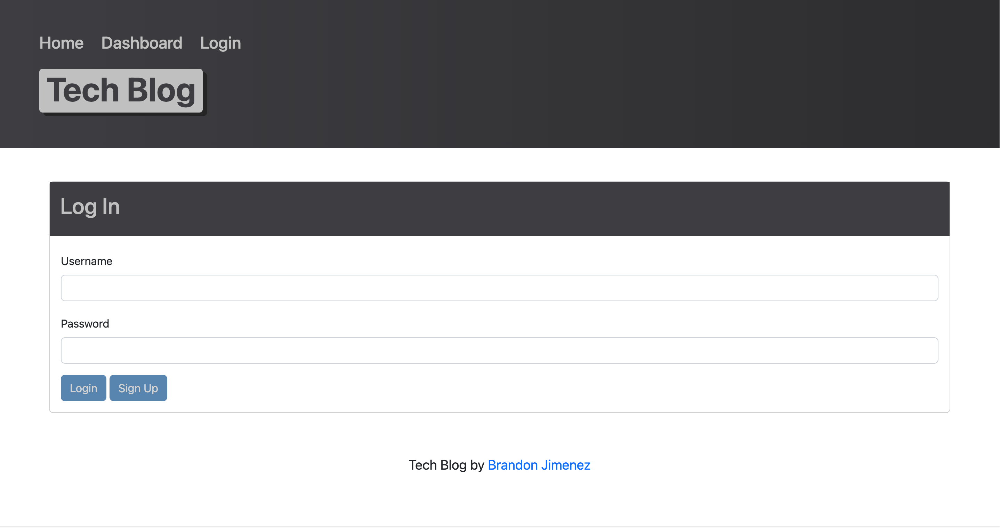

# Tech-Talk

## Description


This Tech Blog is a CMS style project utilizing the MVC structure, routes, SQL and Handlebars templating. In this website, users can view/edit posts, leave comments login and register. 

## Table of Contents 

* [Installation](#installation)
* [Usage](#usage)
* [Screenshot](#screenshot)
* [Credits](#credits)
* [License](#license)
* [Badges](#badges)

## Installation

To install the files into your local repo, using Git Bash Terminal:

Please install [NodeJS](https://nodejs.org/en/) and the below npm packages

```Terminal Commands
npm i init -y
npm i
npm i bcrypt
npm i connect-session-sequelize
npm i dotenv
npm i express
npm i express-handlebars
npm i express-session
npm i handlebars
npm i inquirer
npm i mysql2
npm i nodemon
npm i sequelize
 ```

Please Run "SOURCE db/schema.sql;" at least once in your MySQL terminal.

```
mysql -u root -p

-SOURCE db/schema.sql;
```

Please add your information to ".env" file and provide personal DB_PASSWORD, DB_NAME, DB_USER and SESS_SECRET.

## Usage

Direct your terminal to the repository root directory and run this command line to initiate application:

```
npm seed
```

Then

```
npm start
```

Direct your browser to "http://localhost:3001/"

## Screenshot

Heroku Deployed Application:
(https://quiet-meadow-92526.herokuapp.com/)



## License

This application is covered under the MIT license.

## Badges


